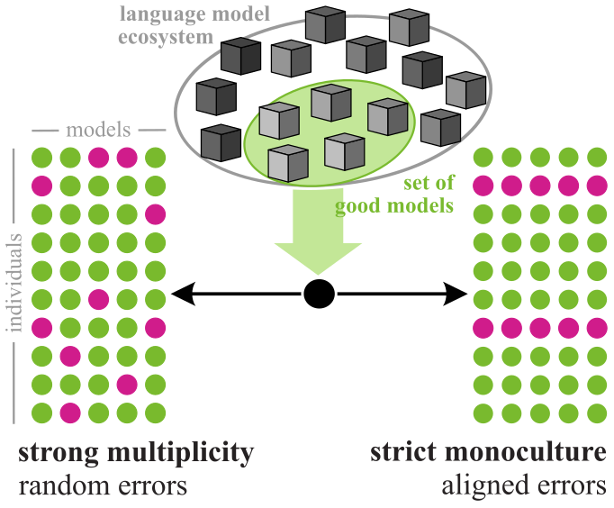

# Monoculture and Multiplicity: Which is it?

<p align="center">

</p>

## Setting up the environment
- Create a virtual environment running: `conda env create -f environment.yml`
- For tableshift, we created a fork that primarily allows to get the full i.i.d. dataset rather than specific splits. 
    1. download the fork [here](https://github.com/milagorecki/tableshift-custom)
    2. in the tableshift folder, install the package using ``` pip install -e .```
    to install remaining dependencies. 
- To extend folktexts, we created a custom fork, available [here](https://github.com/milagorecki/folktexts-custom)
    1. download the fork
    2. in the folktexts folder, 
        - install the package using `pip install -e . `
        - create model dataset and results folder `mkdir data models results`
        - download models and tokenizers using e.g. ```download_models --model 'google/gemma-2b' --save-dir models```
    3. manually re-install `xport` and `pandas`. *Note*: This will lead to a pip dependency warning for xport. But both packages work fine together, so ignore or adjust requirements in xport. 

        `pip install xport==3.6.1`

         `pip install pandas==pip install pandas==2.2.3`

        If this step is missed, there will be some error when trying to load the BRFSS dataset. 
- Datasets will be downloaded when running the respective benchmarks and stored for future runs. 

## Getting Model Predictions
From inside the folktexts package, run 
```
# 0-shot 
python -m folktexts.cli.launch_experiments_htcondor --executable-path ./folktexts/cli/run_benchmark.py --results-dir '<path/to/results/folder/>' --task=ACSIncome --models-dir '<path/to/models/>' --model=google/gemma-2b --fit-threshold=2000 --variation="format=bullet;connector=is;granularity=original;order=AGEP,COW,SCHL,MAR,OCCP,POBP,RELP,WKHP,SEX,RAC1P"

# 10-shot
python -m folktexts.cli.launch_experiments_htcondor --executable-path ./folktexts/cli/run_benchmark.py --results-dir '<path/to/results/folder/>' --task=ACSIncome --models-dir '<path/to/models/>' --model=google/gemma-2b --fit-threshold=2000 --reuse-few-shot-examples=True --few-shot=10 --balance-few-shot-examples=True --variation="format=bullet;connector=is;granularity=original;order=AGEP,COW,SCHL,MAR,OCCP,POBP,RELP,WKHP,SEX,RAC1P"
```
See [here](https://github.com/milagorecki/tableshift-custom) for further options. For example, use `--dryrun` to check which jobs will be started without actually starting them.


When not on an htcondor cluster, you can run the benchmarks locally using the `run_benchmark.py` script:
```
python -m folktexts.cli.run_benchmark --model google/gemma-2b --results-dir './results/' --data-dir './data' --task=ACSIncome --subsampling=0.01 --variation="format=bullet;connector=is;granularity=original"
```

## Baseline Predictions
From inside the mono_multi package, run
```
python -m  mono_multi.baseline.run_acs_benchmark_baseline --model Constant --results-dir '<path/to/results/folder/>' --data-dir '../folktexts-adapted/data/' --task <task>
```


## Analyze model predictions for monoculture and multiplicity 
- All metrics are collected in `metrics.py`.
- For plotting, follow the respective notebook provided. 

